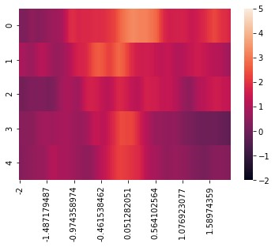

# CRISPR/Cas9 Paper
 All analysis code used in “Viral tools for cell specific single-vector CRISPR/Cas9 editing and genetically-encoded tool delivery in the central and peripheral nervous systems” (Moffa 2023)

# Analysis Sections
## Evoked_all
The evoked_all package of programs is designed to analyze slice electrophysiology data where an optogenetic or electrical stimulus is used to generate one or more postsynaptic current events (inhibitory postsynaptic current=IPSC, or excitatory postsynaptic current=EPSC). Both evoked_VP and evoked_NAc extract the current values and pulse times from .abf (axon binary files) produced by Molecular Devices recording software. Both use the package pyABF, developed by SW Harden (https://pypi.org/project/pyabf/).
### evoked_VP
evoked_VP is used in the paper to extract the peak evoked excitatory and inhibitory current from recordings made from postsynaptic targets of Vglut2+ projections from the VP to LHb. It then averages the current values from 10 ms before to 10 ms after the peak value to get a 20ms average. The peak and 20ms average are exported to a csv, and the program then makes a graph of all evoked pulses from that file.

### evoked_NAc
evoked_NAc is used in the paper to extract the peak evoked inhibitory current from recordings made from postsynaptic targets of local Vgat+ inhibitory neurons in the NAc. It then finds the 10% and 90% values, the times at which the 10% and 90% values occur, the latency, and the rise time of the evoked current. These data are exported to a csv, and a graph of all evoked pulses is made.

### abf_reader_VP and abf_reader_NAc
Both abf_reader_VP and abf_reader_NAc are designed to quickly analyze folders of multiple axon binary files, export all data to a single csv file for easy analysis, and generate graphs for all files.
## heatmap_GCaMP
### guppy_fmt
guppy_fmt takes csv files with GCaMP8f photometry data, cue and reward time data, and mouse xy data and converts it to a guppy-useable format. This data is then uploaded to guppy for analysis (https://github.com/LernerLab/GuPPy).
### heatmap_GCaMP
heatmap_GCaMP extracts photometry data + cue and reward times and uses this to generate heatmaps of GCaMP8f activity surrounding tone cue and reward stimuli.

 
# Input Parameters
Input parameters used for analysis in GuPPy.
